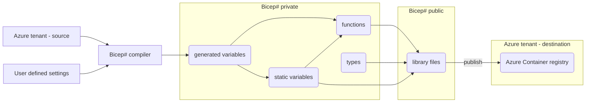

# Bicep# #

[![CC BY-NC-SA 4.0][cc-by-nc-sa-shield]][cc-by-nc-sa]


Bicep# (pronounced Bicep sharp) is a functional framework designed to streamline the use of Azure Bicep. By offering variables, types, and functions, Bicep# aims to simplify infrastructure as code and set the standards for what a good infrastructure as code framework looks like.

## Benefits of Bicep# ##

Bicep# provides the following advantages:

1. **Customized environment variables:** Bicep# automatically generates variables tailored to your policies, environment resources, and the latest Azure changes. This includes tenant-specific roles, enterprise apps, service tags, and global settings, ensuring up-to-date and easy to use information.

2. **Rethinks the module pattern:** Module oriented libraries like [Azure Verified Modules](https://azure.github.io/Azure-Verified-Modules/) aim to modularize each resource. With Bicep#, the approach is to:

   - **Provide a way to mix and match better than modules:** Bicep# provides centralized types, functions and variables you can use over and over again, without being isolated into a single module, where some [types](https://github.com/Azure/bicep-registry-modules/blob/24e4a79e840088f266002631efdc0383ea9e98a0/avm/res/storage/storage-account/main.bicep#L652) and [patterns](https://github.com/Azure/bicep-registry-modules/blob/24e4a79e840088f266002631efdc0383ea9e98a0/avm/res/storage/storage-account/main.bicep#L449) are actually not that reusable at all. For instance, in Bicep#, you make an NSG rule without having to look up what the service tags are, or what the destination service structure looks like, or without restricting in what module your NSG rule ends up in. You decide, and Bicep# gets you the additional information and structure you missed out on.
   - **Prevent overuse of modules:** Many use cases for Bicep modules are obsolete with the introduction of user-defined concepts in Bicep. Technically, modules are just separate deployment templates (and server side sub-deployments in Azure). There used to be no other way to centralize logic than to use templates and reference them. With Bicep#, there shouldn't be much reason to keep modularizing everything with the concept of Bicep modules. That doesn't mean modules don't have a use case anymore, but it sure isn't as much of a big deal anymore.
   - **Respect the simplicity of Bicep, and only provide functionality that extends your workflow instead of overhauling it:** Giving in on enterprise-scale libraries most likely means overhauling a large part of your infrastructure. When keeping things small and functional oriented, you can effectively refactor either big or small parts of your infrastructure, where it matters to you the most.

3. **Compatible with Azure Container registry (ACR):** All types, function and variables can seamlessly integrate with ACR.

4. **Scalable framework design:** Bicep# is designed with scalability in mind, providing a straightforward [technical design](#technical-design) to facilitate project development.

## Demo ##

See Bicep# [/lib/network](/lib/network.bicep) in action!


## Samples ##

The samples use local files and not from a registry, but give a good idea how to use Bicep#. Try out [the samples](/samples/) by running the following commands:

```bash
az login
az deployment sub create --location westeurope --template-file samples/main.bicep --parameters samples/main.dev.bicepparam 
```

Or just build the sample locally:

```bash
az bicep build --file samples/main.bicep
```

## Status ##

This project is currently in preview and only has the most basic functionality. You can help by expanding it.

## Compile ##

Compiled files are outputted to [/lib/private/variables/generated/](/lib/private/variables/generated/).

To compile, make sure to install [PowerShell Az](https://www.powershellgallery.com/packages/Az) (11.5.0 or higher), then run with:

- param `location`, a location (a valid Azure region), for instance `westeurope`;
- param `allowPublicResources`, either `0` or `1`. Sets the public network access property on resources.

```powershell
Connect-AzAccount
./scripts/Build-Lib.ps1 -location westeurope -allowPublicResources 0
```

## Deploy ##

Ideally, deploy the [/lib/](/lib/) files to an [Azure Container Registry](https://learn.microsoft.com/en-us/azure/container-registry/container-registry-intro) for improved reusability in your project or organization.

To deploy, make sure to:

- [compile](#compile) Bicep#;
- provision an Azure Container Registry into your tenant;
- add Bicep to your PATH by [installing manually](https://learn.microsoft.com/en-us/azure/azure-resource-manager/bicep/install#install-manually).

Then run with:

- param `acrLoginServer`, the login server of an Azure Container Registry, for instance `acrbicepsharp.azurecr.io`;
- param `versionPostfix`, sets the version of the files to publish, if the version already exists, it will overwrite.

```powershell
Connect-AzAccount
./scripts/Publish-Lib.ps1 -acrLoginServer "acrbicepsharp.azurecr.io" -versionPostfix 1
```

After deployment, you can use any of the public lib files in your own project by referring to the ACR in a Bicep file, for instance like this:

```bash
import * as sharpNetwork from 'br:acrbicepsharp.azurecr.io/bicepsharp/network:v1'
```

## Technical design ##



### Casing ###

Bicep filenames are snake-case in order to support imports into Azure Container registry.

PowerShell filenames use [Approved Verbs for PowerShell Commands](https://learn.microsoft.com/en-us/powershell/scripting/developer/cmdlet/approved-verbs-for-windows-powershell-commands) and follow their default casing pattern.

Bicep variables, functions, types and all other filenames are lower camel case, as described in their [Best practices](https://learn.microsoft.com/en-us/azure/azure-resource-manager/bicep/best-practices#names).  

### Public facing ###

The root of [/lib/](/lib/) contains public variables, types and functions to be used by the end-user, smartly grouped together, to;

- reduce the amount of imports for the end-user;
- reduce the total size of templates after import;
- keep the public facing files readable.

### Breakdown of lib files ###

Lib files should only have a use case within two scopes at most, and ideally just one scope, except for the `resource` and `tag` lib.

| Public lib | Groups together... | Makes sense to use in files with scope... |
| -- | -- | -- |
| resource | Generic usages on resources, resource groups and modules | resourceGroup and subscription  |
| tag  | Tagging | bicepparam and subscription  |
| authorization | [Azure Role Based Access Control](https://learn.microsoft.com/en-us/azure/role-based-access-control/overview) | resourceGroup  |
| network | [Azure Networking](https://azure.microsoft.com/en-us/products/category/networking) | resourceGroup |
| storage | Azure Storage | resourceGroup |
| devops-services | DevOps Services | bicepparam |
| entra-id | Entra ID | bicepparam  |

### Breakdown of artifacts in lib files ###

Public functions are either;

- helper functions, prefixed by `get`, `calculate`, `create` etc..., or;
- resource builder functions, prefixed by `build` and appended with the resource to build, for instance `buildVnet`. These functions will always return a complete resource with at least `name` and `properties`, as specified by the types `resourceFormat` and `resourceFormatWithDefaultName` in [/lib/private/types/resource.bicep](/lib/private/types/resource.bicep).
  - Building the `properties` of a resource will always be done in a private function file at [/lib/private/functions/](/lib/private/functions/).
  - Building the `name` of a resource will only be done in a private function file at [/lib/private/functions/](/lib/private/functions/) if the name is being built in more than one public function or if it's more than a one-liner.

Public variables are;

- never fully written down, but always specified and referenced from a private facing file at [/lib/private/variables/](/lib/private/variables/).

Public types are;

- never fully written down, but always specified and referenced from a private facing file at [/lib/private/types/](/lib/private/types/).

### Private facing ###

[/lib/private/](/lib/private/) contains private variables, types and functions, grouped by resource type, to be used by public facing Bicep# files.

#### Global values ####

Preferably, introduce global values and use them directly inside functions instead of introducing a new parameter for a function. Global values make sense if they are common tenant-wide settings.

During [compilation](#compile), [/scripts/New-FrameworkGlobals.ps1](/scripts/New-FrameworkGlobals.ps1) outputs separate text files in [/lib/private/variables/generated/](/lib/private/variables/generated/) for each global value, to preserve efficient loading with `loadTextContent()`. Because we cannot use variables inside functions, these files can directly be used inside any private function.

## License ##

This work is licensed under a
[Creative Commons Attribution-NonCommercial-ShareAlike 4.0 International License][cc-by-nc-sa].

[![CC BY-NC-SA 4.0][cc-by-nc-sa-image]][cc-by-nc-sa]

[cc-by-nc-sa]: http://creativecommons.org/licenses/by-nc-sa/4.0/
[cc-by-nc-sa-image]: https://licensebuttons.net/l/by-nc-sa/4.0/88x31.png
[cc-by-nc-sa-shield]: https://img.shields.io/badge/License-CC%20BY--NC--SA%204.0-lightgrey.svg
